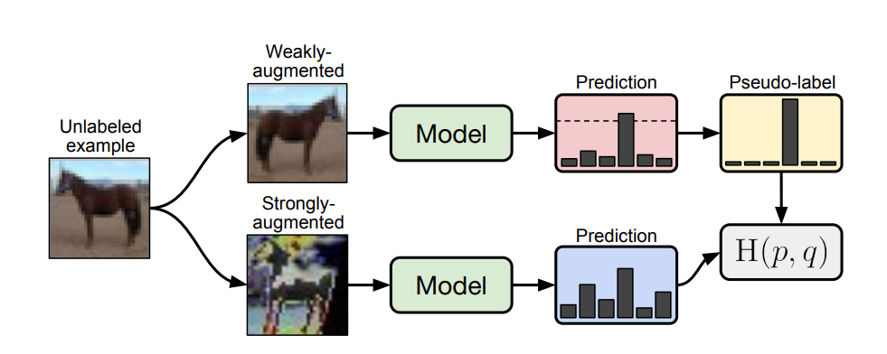

# [FixMatch: Simplifying Semi-Supervised Learning with Consistency and Confidence](https://arxiv.org/pdf/2001.07685.pdf)




## Results

|           | CIFAR-10 |
| --------- | -------- |
| Labeld    |          |
| Unlabeld  |          |
| Acc       |          |
| Acc top 3 |          |


## Hparams

| params        | default value | desc                                      |
| ------------- | ------------- | ----------------------------------------- |
| dataset       | cifar10       | target dataset                            |
| num_classes   | 10            | dataset class count                       |
| num_labeld    | 4000          | labeld dataset size                       |
| expand_labels | False         |                                           |
| backbone      | resnet50      | training model                            |
| device        | cuda:0        | target device                             |
| num_workers   | 8             | dataloader worker process count           |
| total_steps   | 1048576       | total training step size                  |
| batch_size    | 64            | batch size                                |
| lr            | 0.03          | learning rate                             |
| warmup        | 0             | warmup step                               |
| weight_decay  | 0.0005        | optim weight decay                        |
| nesterov      | True          | rov momentum flag                         |
| use_ema       | True          | ema flag                                  |
| ema_decay     | 0.999         | ema decay mount                           |
| mu            | 7             | mu                                        |
| lambda_u      | 1             | coefficient of unsupervised learning loss |
| T             | 0.4           | softmax temperature                       |
| threshold     | 0.8           | unsupervised softmax threshold            |
| seed          | 42            | LIFE, THE UNIVERSE, AND EVERYTHING        |

## Training

```bash
$ python training.py
```