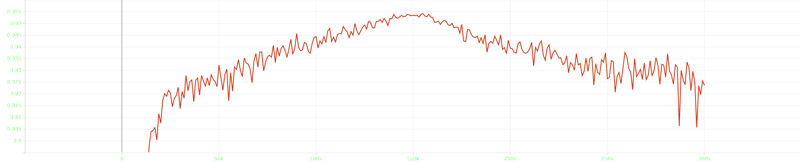
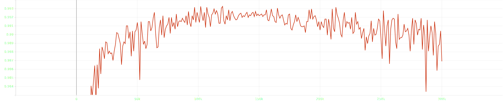

# Meta Pseudo Labeling


## training

```bash
bash scripts/training.sh 
```
or 
```bash
accelerate launch --config_file ./default_config.yaml train.py \
    --total_steps 300000 \
    --batch_size 128 \
    --backbone WideResNet 
```

## Results

| best acc | best acc-top-3 | model      | dataset | labeld-data |
| -------- | -------------- | ---------- | ------- | ----------- |
| 0.9542   | 0.9933         | WideResNet | CIFAR10 | 4000        |


## Plot

### ACC



### ACC top-3
